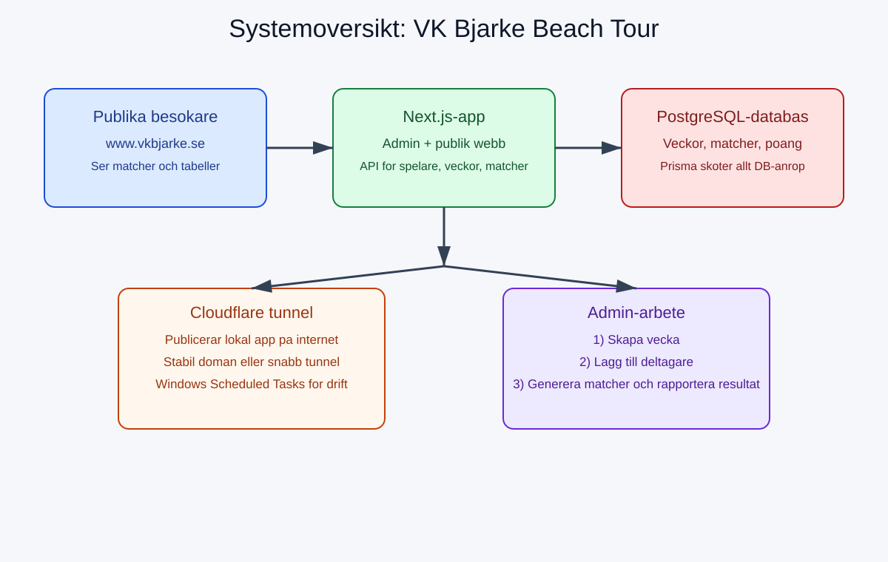
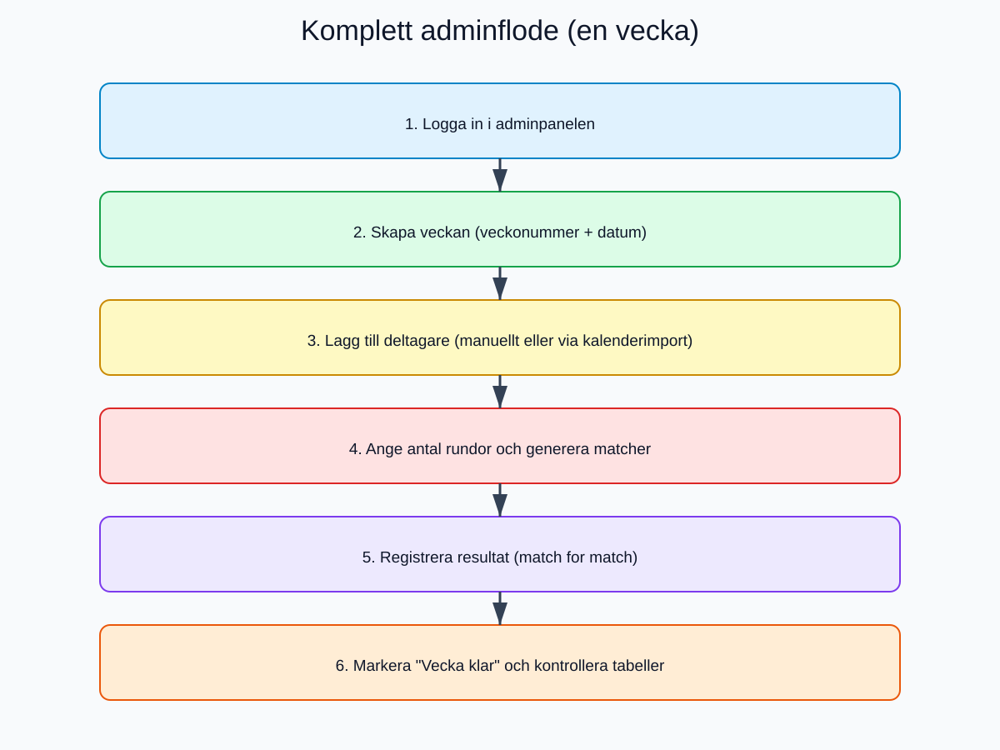
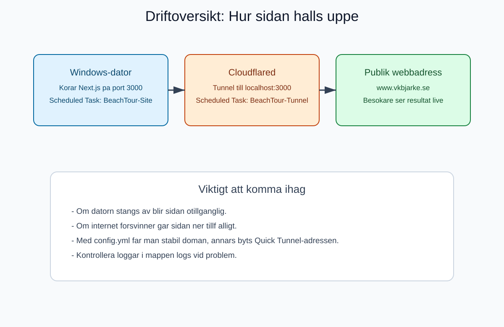
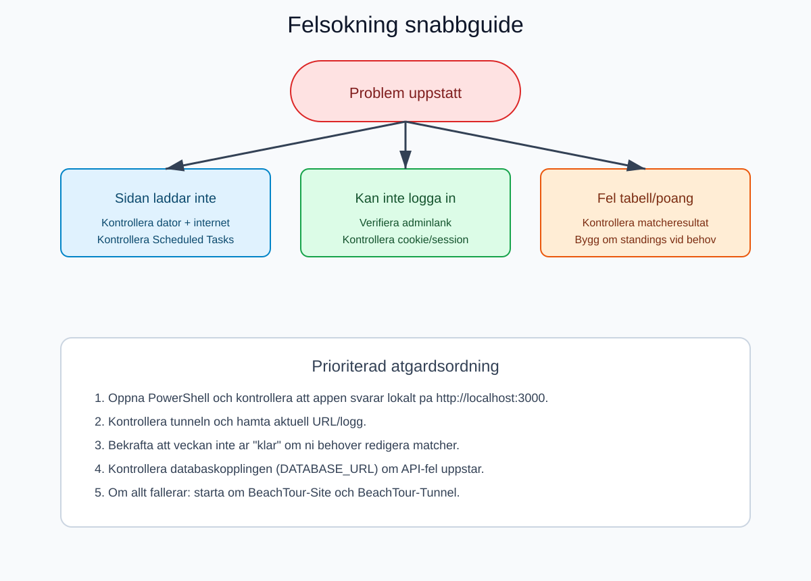
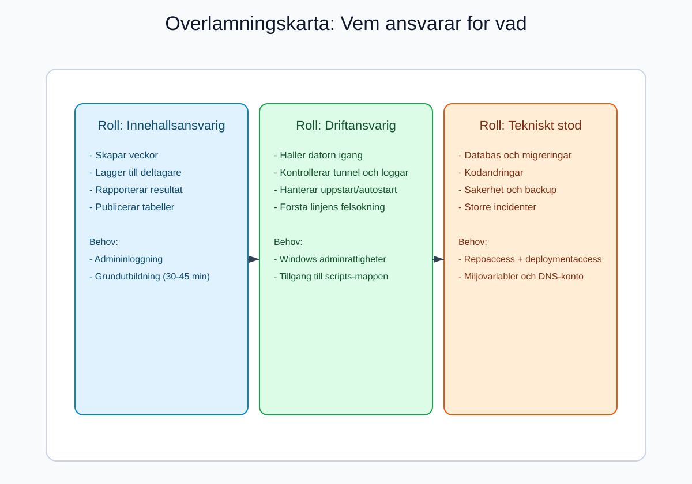

# Overlamning av vkbjarke.se Beach Tour

Denna handbok ar skriven for personer med lag teknisk vana.
Målet ar att ni tryggt ska kunna driva, uppdatera och felsoka sidan.

---

## Snabb sammanfattning

Systemet bestar av:
1. En webbapp (Next.js) med publik vy och adminvy.
2. En databas (PostgreSQL via Prisma) med spelare, veckor, matcher och tabeller.
3. En publicering via Cloudflare Tunnel, som gor att sidan ar synlig pa internet.

Om ni ska minnas en sak: **flodet varje vecka ar alltid samma**:
1. Skapa vecka.
2. Lagg till deltagare.
3. Generera matcher.
4. Registrera resultat.
5. Markera veckan som klar.

---

## Vad sidan gor

### Publik del
Besokare kan:
1. Se matcher.
2. Se veckostallning.
3. Se sasongsstallning.

### Admin-del
Admin kan:
1. Lagg till/radera spelare.
2. Skapa/radera veckor.
3. Lagg till deltagare per vecka.
4. Generera matchschema automatiskt.
5. Rapportera resultat.
6. Justera poangregler.
7. Lasa veckan med "Vecka klar".

---

## Begrepp forklarat enkelt

1. Vecka: en spelvecka i turneringen.
2. Deltagare: vilka spelare som ar med den veckan.
3. Runda: en omgang av matcher.
4. Regndag: poang dubblas automatiskt den veckan.
5. Vecka klar: veckan blir last, matcher och resultat ska inte andras.

---

## Steg-for-steg: Daglig administration

## 1) Logga in

1. Oppna admin-inloggning via publik startsida.
2. Fyll i anvandarnamn och losenord.
3. Om inloggning misslyckas: kontrollera stavning och prova igen.

## 2) Lagg till spelare (vid behov)

1. Gå till Spelare.
2. Skriv namn.
3. Klicka Registrera spelare.

Tips: radera bara en spelare om ni ar helt sakra, eftersom historik for den spelaren tas bort ur flera vyer.

## 3) Skapa ny vecka

1. Gå till Veckor.
2. Ange veckonummer.
3. Ange datum.
4. Klicka skapa.

## 4) Lagg till veckans deltagare

Det finns tva satt:
1. Manuellt: valj spelare och lagg till en och en.
2. Kalenderimport: hamta namn fran aktivitetssidan pa vkbjarke.se.

Om ett namn inte matchar exakt mot befintlig spelare far ni en fraga om vem personen motsvarar.

## 5) Generera matcher

1. Ange antal rundor.
2. Klicka generera matcher.
3. Kontrollera snabbt att upplagget ser rimligt ut.

Obs: om det redan finns rapporterade resultat och ni genererar om matcher, kan gamla resultat tas bort.

## 6) Registrera resultat

1. Gå till Matcher.
2. Fyll i poang for bada lagen i varje match.
3. Spara.

Systemet raknar sedan om:
1. Dagliga rankingar.
2. Veckostallning.
3. Sasongsstallning.

## 7) Markera "Vecka klar"

Nar allt ar verifierat:
1. Gå till Veckor.
2. Satt Vecka klar = Ja.

Darefter ar veckan last for andringar.

---

## Komplett veckoflode (checklista)

Anvand denna som snabbcheck varje vecka:

1. Vecka skapad.
2. Alla deltagare inlagda.
3. Ratt antal rundor satt.
4. Matcher genererade.
5. Alla resultat inlagda.
6. Veckostallning kontrollerad.
7. Sasongsstallning kontrollerad.
8. Vecka markerad som klar.

---

## Drift och uppstart

Webbplatsen kor pa en Windows-dator med tva autostart-uppgifter:
1. BeachTour-Site (startar appen).
2. BeachTour-Tunnel (startar cloudflared).

Om allt fungerar ska sidan vara tillganglig utan manuell start efter omstart av datorn.

### Viktiga begransningar

1. Om datorn ar avstangd ar sidan nere.
2. Om internet ar nere ar sidan nere.
3. Om tunnel inte fungerar syns inte sidan externt.

---

## Felsokning for icke-tekniska

### Problem: Sidan oppnas inte

1. Kontrollera att datorn ar pa och online.
2. Kontrollera att autostart-uppgifter kor.
3. Kontrollera tunnel-loggen.

### Problem: Kan inte redigera matcher

1. Kontrollera om veckan ar satt till "Vecka klar".
2. Om ja: satt till Nej tillfalligt, gor andringen, satt tillbaka till Ja.

### Problem: Tabell ser fel ut

1. Kontrollera att alla resultat ar ifyllda med poang for bada lagen.
2. Kontrollera att matcher inte av misstag har genererats om.
3. Kontrollera regndag-flaggan (kan dubbla poang).

---

## Sakerhet och risker (viktigt)

Nuvarande kodlage har en allvarlig svaghet:
1. Funktionen som validerar admin-inloggning returnerar alltid true.
2. Det betyder i praktiken att inloggning inte ar korrekt lasst till riktigt losenord.

Rekommenderad atgard snarast:
1. Lås riktig kontroll mot ADMIN_USERNAME och ADMIN_PASSWORD.
2. Byt alla standardhemligheter.
3. Dokumentera vem som har tillgang.

---

## Overlamningsplan (praktisk)

Foreslagen overlamning i 3 pass:

### Pass 1 (45 min): Introduktion
1. Visa publik sida.
2. Visa adminpanelens menyer.
3. Gå igenom veckoflode i teorin.

### Pass 2 (60 min): Praktisk ovning
1. Skapa testvecka.
2. Lagg till testspelare.
3. Generera matcher.
4. Rapportera resultat.
5. Markera vecka klar.

### Pass 3 (30 min): Drift och incident
1. Simulera att sidan ar nere.
2. Visa hur man kontrollerar driftstatus.
3. Gå igenom kontaktvagar vid större fel.

---

## Roller att tillsatta efter overlamning

1. Innehallsansvarig: skoter veckor, deltagare, resultat.
2. Driftansvarig: skoter dator, tunnel, uppstart, loggar.
3. Tekniskt stod: skoter kod, databas, uppgraderingar och sakerhet.

---

## Miniminiva for att kunna ta over

En ny administratör anses redo nar personen kan:
1. Logga in sjalv.
2. Skapa vecka och deltagare.
3. Generera matcher.
4. Lägga in resultat.
5. Publicera korrekt tabell.
6. Hantera vanliga fel enligt felsokningsdelen.

---

## Rekommenderade tillagg (framtida forbattringar)

1. Riktig inloggningsvalidering med hashade losenord.
2. Automatisk backup-rutin for databas.
3. Enkel status-sida "gron/gul/rod" for drift.
4. En PDF-version av denna handbok for utskrift.
5. Korta instruktionsfilmer (2-3 min per arbetsmoment).

---

## Kontaktlista (fyll i vid overlamning)

1. Huvudadmin: ________________________
2. Driftansvarig: ______________________
3. Tekniskt stod: ______________________
4. Hosting/DNS-konto agare: _____________
5. Databasansvarig: _____________________

---

Senast uppdaterad: 2026-05-12
